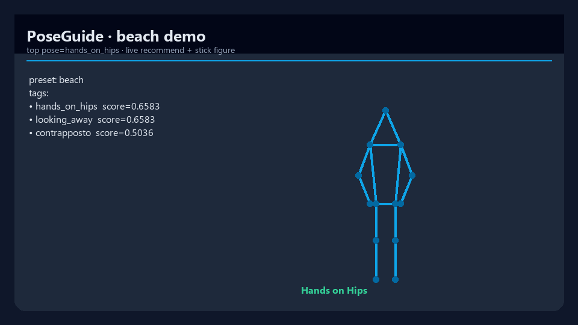
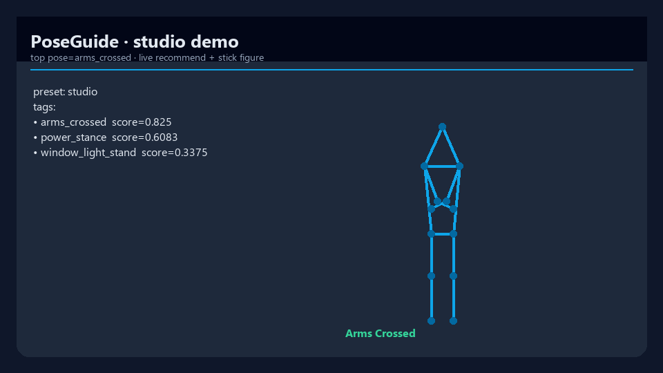

# PoseGuide

[](https://www.python.org/downloads/)
[](pyproject.toml)
[](LICENSE)
[](https://github.com/mergeos-bounties)

**PoseGuide** is a photography **pose coach**: scene tags → ranked standing poses, stick-figure SVG overlays, and offline demos — no camera required for the CLI smoke path.

**Product:** [mergeos-bounties/PoseGuide](https://github.com/mergeos-bounties/PoseGuide)

---

## Table of contents

- [Highlights](#highlights)
- [Screenshots](#screenshots)
- [Quick start](#quick-start)
- [CLI reference](#cli-reference)
- [Presets & data](#presets--data)
- [Diagrams](#diagrams)
- [Repository layout](#repository-layout)
- [Development](#development)
- [MergeOS bounties](#mergeos-bounties)
- [License](#license)

---

## Highlights

| Mode | Description |
| --- | --- |
| **Scene → pose** | Tags (beach, urban, studio…) → ranked pose catalog matches |
| **SVG stick figure** | Render target pose joints as guidance overlay |
| **Score** | Compare subject landmarks vs target pose (scaffold) |
| **Train / eval** | Toy calibration loop + scene evaluation metrics |
| **Offline demo** | `poseguide demo --preset beach` end-to-end |
| **Mobile web demo** | Static `web/` UI for scene tags, background preview, and top poses |

---

## Screenshots

Live demo captures (recommend + stick figure).

| Beach | Urban | Studio |
| :---: | :---: | :---: |
|  |  |  |
| *Beach preset* | *Urban preset* | *Studio preset* |

---

## Quick start

```powershell
cd PoseGuide
python -m venv .venv
.\.venv\Scripts\activate
pip install -e ".[dev]"

poseguide version
poseguide demo --preset beach
poseguide poses list
poseguide poses list --tag portrait --difficulty easy
poseguide poses search --tag jump --difficulty medium
poseguide scenes list
```

SVG / overlay outputs are written under the configured `OUT_DIR` (see `poseguide.config`).

Static web demo:

```powershell
python -m http.server 5173
```

Open `http://localhost:5173/web/` and see [`web/README.md`](web/README.md) for the optional local API contract.

---

## CLI reference

| Command | Purpose |
| --- | --- |
| `poseguide version` | Version + pose/scene counts |
| `poseguide demo -p beach` | Full recommend + SVG for a preset |
| `poseguide guide demo -p beach` | Print the top pose for a built-in scene preset |
| `poseguide poses list [--tag TAG] [--difficulty LEVEL]` | Standing pose catalog with optional exact-tag and difficulty filters |
| `poseguide poses search [keyword] [--tag TAG] [--difficulty LEVEL]` | Search pose fields and combine exact-tag/difficulty filters |
| `poseguide poses svg -p <id>` | Render one pose SVG |
| `poseguide scenes list` | Scene samples |
| `poseguide guide …` | Recommend / score helpers |
| `poseguide train` / `eval` | Toy train + evaluation |
| `poseguide data extract -i  -o <json>` | Extract joints from a photo (optional `[vision]` extra) |

**Presets:** `beach` · `urban` · `studio` · `forest` · `office`

```powershell
poseguide demo -p urban
poseguide demo -p studio

poseguide guide demo --preset beach
poseguide guide demo --preset urban
poseguide guide demo --preset studio
```

---

## Presets & data

| Area | Location |
| --- | --- |
| Pose catalog | `data/poses/` |
| Scene samples | `data/scenes/` |
| Demo presets | `poseguide.guide.demo.PRESETS` |
| Web demo catalog | `web/data/catalog.json` |

---

## Diagrams

System architecture and workflow — full width. Open the HTML files for **dark/light theme** and export (PNG/SVG).

### Architecture

[Open interactive diagram](docs/diagrams/architecture.html)

<p align="center">
  
</p>

### Workflow

[Open interactive diagram](docs/diagrams/workflow.html)

<p align="center">
  
</p>

*Generated with [archify](https://github.com/tt-a1i).*

---

## Pose extraction (`[vision]` extra)

Extract a normalized standing skeleton from a still photo into a PoseGuide
subject JSON — same `joints` schema (`nose`, `l_shoulder`, `r_shoulder`, …)
used everywhere else in the library.

```powershell
pip install -e ".[vision]"    # opencv-python-headless + mediapipe + Pillow
poseguide data extract --image path/to/photo.jpg --out data/samples/custom.json
```

- **Graceful degradation:** the `mediapipe` / `cv2` imports are lazy. Without the
  `[vision]` extra the CLI reports a clear, actionable error instead of crashing.
- **Injectable detector:** `poseguide.data.extract.extract_pose(image_path, detector=…)`
  accepts any callable that maps an image path to a MediaPipe landmark list, so
  the mapping logic is fully unit-tested with a fake detector — no model binary
  required. The default detector supports both the legacy `mediapipe.solutions`
  API and the modern Tasks API (`PoseLandmarker`, via `POSEGUIDE_POSE_MODEL`).
- **Privacy:** no images are committed; extraction writes only normalized joints.

---

## Repository layout

```text
src/poseguide/
  cli.py
  guide/          # recommend, score, demo presets
  render/         # SVG stick figure, overlay JSON
  data/loader.py  # poses & scenes
  web/catalog.py  # static web catalog export
  train/          # toy calibration
  eval/           # metrics
docs/screenshots/
docs/diagrams/
web/
```

---

## Development

```powershell
pytest -q
ruff check src tests
poseguide demo -p beach
```

---

## MergeOS bounties

Star this repo + [mergeos](https://github.com/mergeos-bounties/mergeos) → claim bounty issue → PR to **master** → MRG **25–200**.

Evidence: demo SVG / stick-figure screenshots + recommend JSON.

### Pose Pack Contribution Guide

Ready to contribute a pose pack? See [docs/CONTRIBUTE_POSE_PACK.md](docs/CONTRIBUTE_POSE_PACK.md) for schema, joints requirements, difficulty levels, and evidence checklist.

---

## License

MIT · MergeOS / ThanhTrucSolutions
